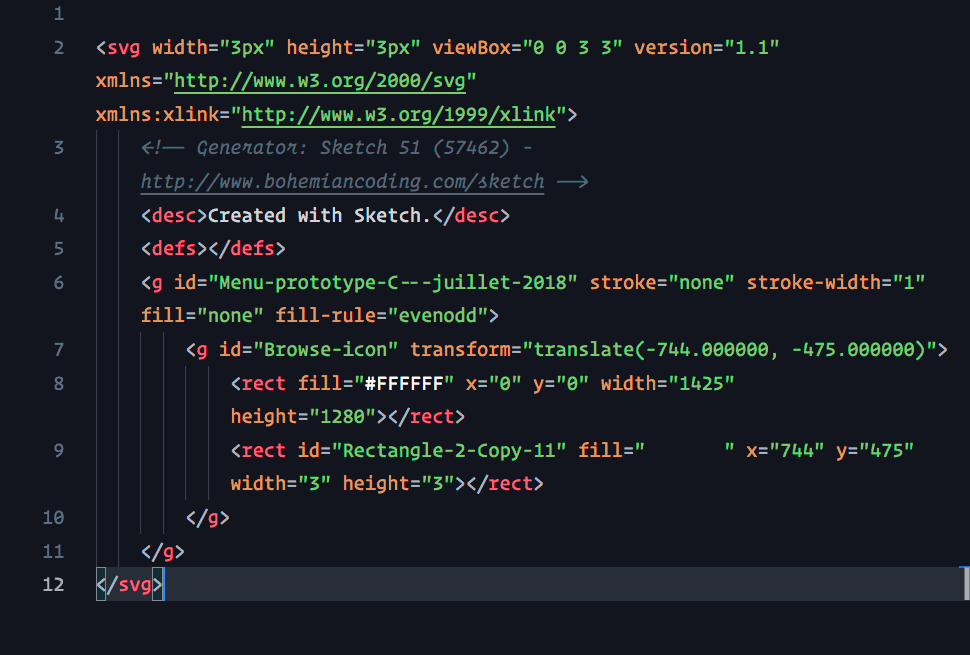
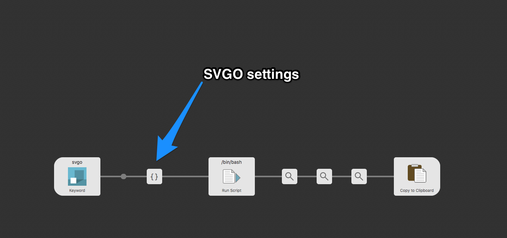

# Alfred SVG Optimizer

Let you optimize through [SVGO](https://github.com/svg/svgo) your copied SVG markup.

# [📥 DOWNLOAD](SVGO.alfredworkflow)

## Settings

You can define your own [SVGO configuration](https://github.com/svg/svgo#what-it-can-do) by editing the JSON filter :

